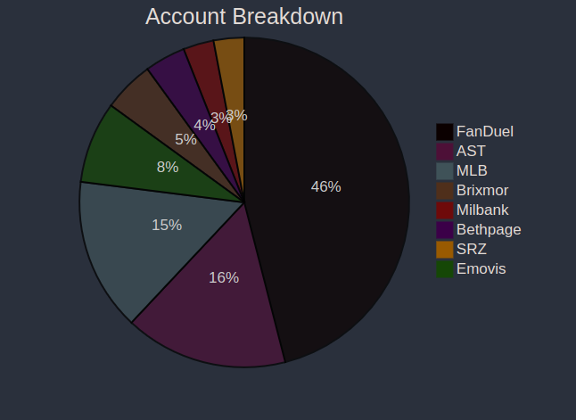
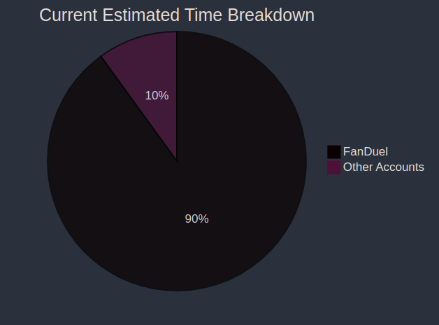
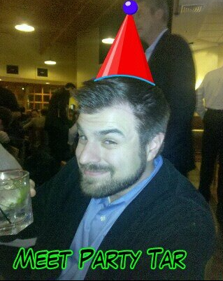

# Thomas Tar #

---

# Who Am I #

###### Official Title: ######
- Solution Specialist or Solution Architect
- Been with CC since 2007 (15 years)

###### My Main Purpose ######
- The FanDuel Guy (selling, engineering, escalation, operations)
- Help drive new opportunities in new and existing accounts

---

# Opps and Challenges #

###### Opportunities ######
- Working primarily on the FanDuel project has allowed me to see the true value of the 'DevOps' movement.  Our growth as a team will be heavily tied to the our ability to provide 'DevOps' value to our client base

###### Challenges ######
- Balancing the needs of the giant needy whale (FanDuel) with other opportunities.
- Finding the next 'FanDuel'  

---

# Personal Investiments #

###### In the last 12 months... ######
- Learned new and emerging technologies like OpenStack!!
--(if you don't know OpenStack is not the future) 
- Didn't work out one minute ..... and it shows 
- Focused on work and helping to raise (5) kids, unfortunately left littel time for personal investiment
- Will be a focus of mine for second half of 2022
-- Diet starts....tomorrow :)

---

# Profession Accomplishments #

###### Emovis ######
- New Logo, Legacy Expert Services (Storage, Backup, Network) @ 13k/mon
- 6 Month deal process, main decision makers in Europe

###### FanDuel ######
- Support (10) sites despite losing key engineer at the beginning of all deployments
- Working to stay revelent while FanDuel moves more operations to AWS.

###### Brixmor Renewal ######
- Customer demands exceeded that of current MRR, offered take it or leave it 2x quote
- Called customer bluff and they signed the contract. Renewal just signed!
- Special thanks to Paige, Mike and VB

---

## Value to Business #

###### MMR:  ~$178k ######

- FanDuel represent a significant % of my account value
- Majority remaining accounts close to 10+ years of service!
- (1) new account added in 2022 (Emovis)

---

## Reflections and Future ##

- Too much time spent on one account.
- FanDuel's revenue will drop and so will my time towards it.
- 2022 and beyond must be about net new accounts.
- 2022 will be about growing the next set of Solution Specialists to grow the business

---

## Enjoy The Week! ##

- I am SO sorry I couldn't be there this week.
- Don't Party Too Hard :)
- and someone please record Rich's karaoke performance!

#### THANK YOU Professor Matos for being my proxy! #### 

