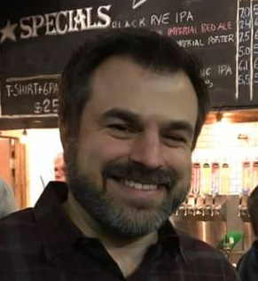

# Thomas Tar #

---

# Who Am I #

Official Title: 
- Solution Specialist or Solution Architect

My Main Purpose
- FanDuel guy (or person)
- FanDuel escalation point
- Help drive new opportunities in new and existing accounts

---

Opps and Challenges

Opportunities 
- Working primarily on the FanDuel project has allowed me to see the true value of the 'DevOps' movement.  Our growth as a team with heavily tied to the our ability to provide DevOps value to our client base

Challenges
- Balancing the needs of the giant needy whale (FanDuel) with other opportunities.
- Finding the next 'FanDuel'

---

Personal Investiments

---

# Profession Accomplishments #

- Emovis
-- New Logo, Legacy Expert Services (Storage, Backup, Network)
-- ~$13k/mon
-- 6 Month deal process, main decision makers in Europe

- FanDuel
-- Continue to successfully support (10) sites despite losing key engineer at the beginning of all deployments
-- Working to stay revelent while FanDuel moves more operations to AWS.

- Brixmor Renewal
-- Customer demands exceeded that of current MRR
-- Positioned take it or leave it 2x quote
-- Despite a lot complaining, customer signed the contract.  Currently just completed renewal of expanded contract
-- Special thanks to Paige, Mike and VB

---

Value to Business

MMR:  ~$178k

---

Reflections

---

The Future!!

---

Cute Pics of Kids